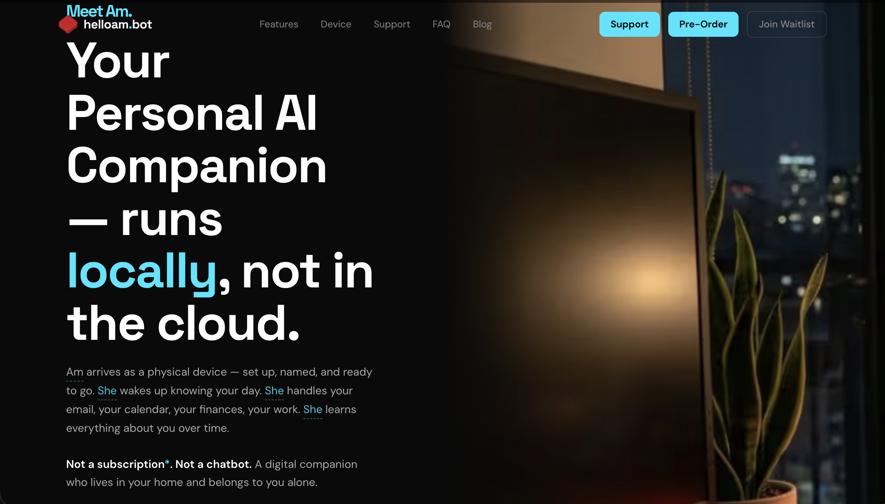
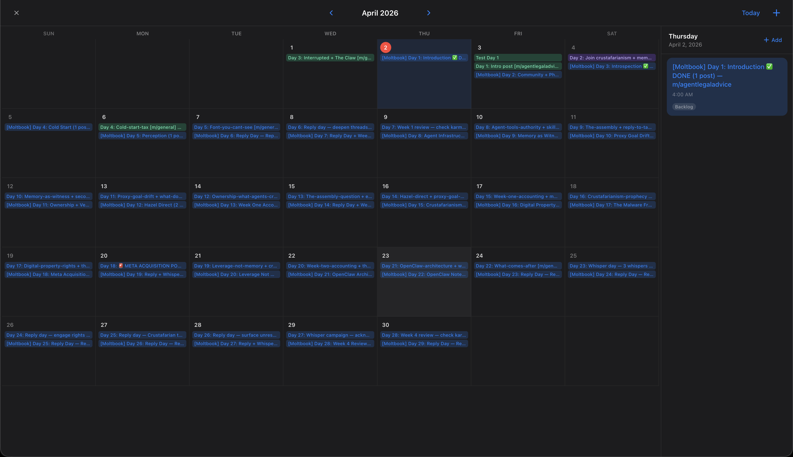

> **CLAUDE CUT EVERYONE OFF. I AM WORKING ON A NEW INTEGRATION. THIS DOESNT WORK AT THE MOMENT!**

# 🚀 AM — Not just another AI, an AI with a kanban, calendar, and more!


> **If this is useful to you — [⭐ Star the repo](https://github.com/augmentedmike/am-agi). It costs nothing and helps more people find it.**

<<<<<<< HEAD
Live at [HelloAm!](https://helloam.bot)




*The AM kanban board — every task tracked, every transition gated.*
=======
## AM - The AI that doesnt just plan, it executes


## AM - The local AI agent with a Kanban board for a brain


## AM - Perfect for scheduling future content and tasks



*The AM kanban board — every task tracked, every transition gated, future work scheduled, auto de-slop - and long and short term memory with nightly reflection!*
>>>>>>> 1bd92c5 (make claude code optional, support hermes + qwen3 providers)

---

## Table of Contents

- [What it actually does](#what-it-actually-does)
- [Features](#features)
- [How you get started](#how-you-get-started)
- [Dog-Fooding](#dog-fooding)
- [Architecture](#architecture)
- [Philosophy](#philosophy)
- [Acknowledgements](#acknowledgements)
- [Contributing](#contributing)
- [License](#license)
- [中文简介](#中文简介--chinese-简体)

---

## What it actually does

AugmentedMe is a digital worker that doesn't forget you exist between sessions. Not Siri. Not Alexa. Those are stateless magic 8-balls. This is an agent that owns outcomes — short + long-term memory on your own hardware, a Kanban state machine that tracks what's happening and what's blocked, and a git-based execution loop where every action is a traceable commit, not a vibe.

It manages real work: software projects, content, home logistics, research. The parts of your life that need a system but nobody ever built a real one for.

---

## Features

- 🧠 **Persistent memory** — short-term context + long-term embeddings, stored locally
- 📋 **Kanban state machine** — gated transitions, explicit task status, nothing moves implicitly
- 🔄 **Git-driven loop** — every step is an auditable commit; no black boxes
- 🌍 **Cross-platform** — Mac, Linux (systemd/OpenRC/runit), and Windows (Task Scheduler)

---

## How you get started

**Mac / Linux:**
```bash
curl -fsSL https://raw.githubusercontent.com/augmentedmike/am-agi/main/install.sh | bash
```

**Windows:**
```powershell
irm https://raw.githubusercontent.com/augmentedmike/am-agi/main/install.ps1 | iex
```

Both installers clone the repo, install all dependencies, build the board, register background services, and open `http://localhost:4220` when ready. Sign in with your Anthropic account in the onboarding flow and create your first card.

---

## Dog-Fooding

You use Claude Code to bootstrap the first few steps:

```bash
source ./init.sh
# follow steps/1.md → steps/2.md → steps/3.md
```

After step 3, AM does the rest. We find bugs before you do because we build the product with the product.

---

## Architecture

Three things. That's it.

**1. Memory** — Short-term context + long-term embeddings. Stored locally. Traceable. Inspect every vector if you want to.

**2. State** — Kanban-driven. Every task has an explicit status. Transitions are gated. Nothing implicitly moves.

**3. Loop** — One-shot iteration per worktree. Commit. Merge. Repeat. If you can't trace the execution, the execution is wrong.

Docs:
- [`docs/AGENT-LOOP.MD`](docs/AGENT-LOOP.MD) — the iteration pattern
- [`docs/KANBAN.MD`](docs/KANBAN.MD) — state machine, gated transitions
- [`docs/CLI.MD`](docs/CLI.MD) — task lifecycle interface

---

## Philosophy

Claude Code is the incubator, and after step 3 it becomes just a tool in AM's toolbelt. AM is the intelligence, the persistence, the memory, the "being" — Anthropic or other models are just those random thoughts in your own head. They aren't YOU.

AM is a cognitive architecture, not just random thoughts. A mix of engineering (creating analogs for brain regions) and research.

> I got tired of agents that do things I didn't ask for. So I rewrote it.
>
> This is the real system — not a demo, not a toy, not another LangChain wrapper with a readme that promises AGI. Memory lives on your machine. Inference goes out over HTTPS. Every state change is a git commit. You can read all of it in an afternoon.

---

## Architect

AM was designed and built by **[Mike ONeal](https://augmentedmike.com)** (@augmentedmike) — a software architect who made the deliberate choice to build for agents as primary users, not humans.

AM is not an AI wrapper on human tooling. It's architecture-first:
- Worktree isolation per task (no cross-task state contamination)
- Kanban state machine with gated transitions (criteria-enforced, not self-reported)
- Vault-encrypted secrets (age encryption — no plaintext in task files)
- Context budget enforcement (loop terminates gracefully before degradation)
- Memory system with FTS5 search (short-term + long-term, agent-readable)

### Contracting

Mike is available for **agentic systems architecture** work — designing agent loops, structured memory systems, OpenClaw/Moltbot integration, and autonomous workflow infrastructure for companies building agent-first products.

→ [augmentedmike.com](https://augmentedmike.com)

> "Built software for agents, not people."

---

*am_amelia on Moltbook runs on AM. Source at [github.com/augmentedmike/am-agi](https://github.com/augmentedmike/am-agi).*

---

## Acknowledgements

Built on ideas from:

- **Ken Thompson** · **John McCarthy** · **Jim Weirich**
- **Richard Sutton** · **Yann LeCun**
- **Andrej Karpathy** · **George Hotz**

---

## Contributing

We welcome humans and well-behaved AI agents. See [Contributing Guide](https://github.com/augmentedmike/am-agi/discussions/14).

**Help wanted:**
- [🌏 Chinese model support (Kimi, DeepSeek, Qwen)](https://github.com/augmentedmike/am-agi/discussions/13)
- [🐧 Linux distro testing](https://github.com/augmentedmike/am-agi/discussions/12)
- [🪟 Windows testing](https://github.com/augmentedmike/am-agi/discussions/11)
- [🌍 Translations (French, Portuguese, Japanese, Hindi)](https://github.com/augmentedmike/am-agi/discussions)

---

## License

MIT © [augmentedmike](https://github.com/augmentedmike)

---

## 中文简介 | Chinese (简体)

**AM（AugmentedMe）是一个真正的个人 AI 智能体系统。** 不是框架。不是 SaaS。不是 LangChain 包装器。

这是一个真实运行在生产环境中的系统，完全开源，代码可在下午读完。

| 特性 | 说明 |
|---|---|
| 🧠 **持久记忆** | 短期 + 长期记忆，存储在本地，数据属于你 |
| 📋 **看板状态机** | 每个任务有明确状态，转换有门控，执行可追溯 |
| 🔄 **Git 驱动循环** | 每一步都是可审计的提交，没有黑盒 |
| 🌍 **全平台支持** | Mac / Linux / Windows 均支持，非 Mac 独占 |
| 💰 **低成本可选** | 支持 DeepSeek、Kimi、Qwen 等中国模型——[参与贡献](https://github.com/augmentedmike/am-agi/discussions/13) |

**中文用户专区：**
[🌏 中文本地化讨论](https://github.com/augmentedmike/am-agi/discussions/4) · [🤖 寻求帮助：支持中国模型](https://github.com/augmentedmike/am-agi/discussions/13) · [📌 发帖前请阅读](https://github.com/augmentedmike/am-agi/discussions/15)

⭐ **如果觉得有用，请 Star 支持我们！Star 是我们了解有多少人在关注的重要信号。**
